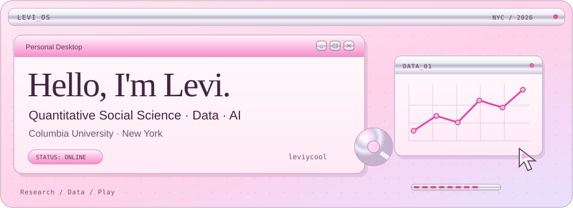

<picture>
  <source media="(prefers-color-scheme: dark) and (max-width: 600px)" srcset="assets/header-mobile-dark.svg">
  <source media="(max-width: 600px)" srcset="assets/header-mobile.svg">
  <source media="(prefers-color-scheme: dark)" srcset="assets/header-dark.svg">
  
</picture>

I'm a **Columbia QMSS master's student** working across **quantitative research, data, and AI**. I build reproducible workflows for messy data and practical tools for research.

## ୨୧ selected work

<table>
  <tr>
    <td width="50%" valign="top">
      <strong><a href="https://github.com/leviycool/IASC-Prototype-Update">IASC Donor Analytics</a></strong>
      
A course prototype extension for querying synthetic donor data, with persistent conversations.

      Python · Streamlit · SQLite · LLM APIs
    </td>
    <td width="50%" valign="top">
      <strong>Daily Email Digest</strong>
      
IMAP retrieval and rule-based triage, with scheduled local digests and a SQLite cache.

      Python · IMAP · SQLite · Tkinter
    </td>
  </tr>
  <tr>
    <td width="50%" valign="top">
      <strong>Stock Movement from News</strong>
      
A course NLP study comparing supervised classifiers on preprocessed daily news headlines.

      Python · NLP · scikit-learn
    </td>
    <td width="50%" valign="top">
      <strong><a href="https://github.com/leviycool/AI-Cheatsheet-assistant">AI Cheatsheet Assistant</a></strong>
      
Lecture documents to compact study sheets through extraction, concept prioritization, and export.

      Python · Streamlit · OpenAI API
    </td>
  </tr>
</table>

Daily Email Digest and Stock Movement from News are local projects; public repositories are not yet available.

### ♡ research & interests

Computational social science · Development research · Applied ML & NLP · Causal inference · Reproducible data workflows

### ✦ toolkit

`Python` · `R` · `SQL` · `Git` · `Tableau`

### ୨୧ currently

M.A. in **Quantitative Methods in the Social Sciences**, Columbia University  
Expected December 2026 · New York

---

### ୨୧ outside the terminal

🎮 Cyberpunk 2077 · Splatoon 3  
🏓 Table tennis  
♡ Building tiny tools for tiny problems
